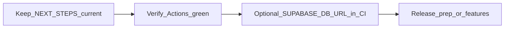

# Family App - Next Steps

Updated: 2026-03-29

## Current status

- **Repo**: [Kay-Jin/Family-APP](https://github.com/Kay-Jin/Family-APP) — local `main` tracks `origin/main` when clean.
- **CI**: GitHub Actions ([`.github/workflows/ci.yml`](.github/workflows/ci.yml)). Latest run on `main` for `5af4047`: **success** (Flutter + Python). See [Actions run #5](https://github.com/Kay-Jin/Family-APP/actions/runs/23679734324). Optional Supabase schema job runs only if repo secret `SUPABASE_DB_URL` is set — [`docs/CI.md`](docs/CI.md).
- **Backend and mobile**: scaffolds and core flows in place (families, daily Q&A, photos, birthdays, care modules, WeChat bridge + Supabase cloud paths as implemented in code).
- **Voice upload**: persistence across app restart (SharedPreferences + stable file path); auto retry and manual retry UI.
- **Tests**: Backend care smoke tests; Flutter unit/widget tests; `scripts/run_tests.ps1` for Flutter analyze + test.
- **Supabase (linked project, verified 2026-03-29)**: `daily_answers.image_path`, Storage bucket `family_answer_images`, RLS/storage policies — **`supabase/tests/schema_checks.sql` → `failed_count = 0`**. If you use **another** Supabase project (e.g. separate prod), run [`supabase/migrations/20260328_answer_images_and_storage.sql`](supabase/migrations/20260328_answer_images_and_storage.sql) there and re-check with `schema_checks` or `scripts/run_supabase_schema_checks.ps1`.
- **Flutter platforms**: `linux/`, `macos/`, `web/`, `windows/` under `mobile/` are in repo for desktop/web builds.

## Suggested order (stability first, then product)



## Do this next (you, in order)

1. **Optional CI hardening**: add GitHub Actions secret **`SUPABASE_DB_URL`** so every push runs `schema_checks` against the DB you care about ([`docs/CI.md`](docs/CI.md)). Without it, the Supabase job skips; Flutter/Python still run.
2. Follow **Release prep checklist** below, or pick **New features** / **Engineering** (see table).

## Release prep checklist (minimal)

- [ ] **Stores**: Google Play / App Store developer accounts, app name, screenshots, short description, content rating questionnaire.
- [ ] **Legal / policy**: Public **privacy policy URL** (required by stores); link it from store listing and optionally in-app settings / About.
- [ ] **Production config**: Supabase production project URLs/keys in release builds only; WeChat / backend URLs point to production, not dev.
- [ ] **Signing**: Android upload key / iOS distribution cert and provisioning profiles configured in CI or local release pipeline.
- [ ] **Stability**: Crash reporting or Play/App vitals; smoke-test login, cloud family, daily Q&A, and image upload on the target Supabase project.

## Completed recently (no longer “next”)

- Pending voice upload retry persisted across restarts.
- Care endpoint integration smoke tests added.
- GitHub Actions CI added; pytest import/multipart fixes; `main` CI green on latest push.
- `.cursor/mcp.json` **removed from git tracking** (still ignore-listed); keep tokens only on your machine — **do not commit** MCP config with secrets.
- Cloud answer-image DDL + Storage: aligned on linked Supabase per `schema_checks` (2026-03-29).

## Last known blockers / risks

- Android builds may still hit **Gradle/plugin download** issues on poor networks (mirrors, cache, or documented workarounds help).
- **Multi-project drift**: if prod and dev are different Supabase projects, confirm each has the same migrations applied.

## Product direction (pick one next focus)

**Default suggestion:** finish **Release prep** above, then ship or iterate on features.

| Track | Examples |
|-------|----------|
| **Release prep** | Store listings, privacy policy URL, prod env checks, crash/analytics |
| **New features** | Deeper care / cloud family / WeChat flows — specify the user scenario |
| **Engineering** | Gradle/network stability, docs for offline or mirror setup |

## Quick start commands

### Backend

```powershell
cd C:\Users\Administrator\Desktop\family-app\backend
.\.venv\Scripts\Activate.ps1
python app.py
```

### Mobile

```powershell
cd C:\Users\Administrator\Desktop\family-app\mobile
flutter pub get
flutter run
```

## Git notes

- Remote: `git@github.com:Kay-Jin/Family-APP.git` (HTTPS URL also works).
- **Do not commit** `.cursor/mcp.json` (contains secrets); it is listed in `.gitignore`.
- Device bugreports under `mobile/bugreport*.zip` are ignored by git.

## Message to resume quickly

Use when reopening Cursor:

`Continue family-app from NEXT_STEPS.md at Desktop\family-app. Repo Kay-Jin/Family-APP; verify latest Actions on main; if using a Supabase project other than the one already checked, run schema_checks / migration 20260328. Then continue release prep or the product track I name.`
